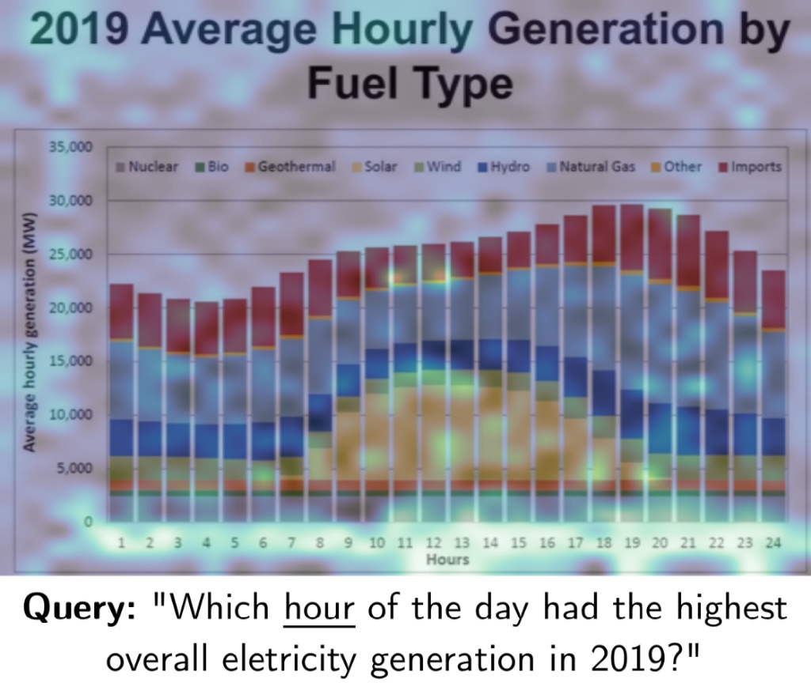

# scholar-rag

A lightweight RAG web app that utilizes the [ColPali](https://github.com/illuin-tech/colpali) vision language model to embed files into batches of embedding vectors. An example is shown here: 

  

After looking into text-chunking strategies, I noticed two things: 
1. They can't parse mathematical formulations well.
2. It requires more complexity to render images and graphs in files. 

And so I decided to look into other methods and found VLMs, specifically the ColPali paper.

---
### Implementation

The application uses FastAPI as the backend, and Streamlit as the frontend. Qdrant Cloud is used to store vector embeddings, and Google Cloud Storage is used to store the uploaded papers.